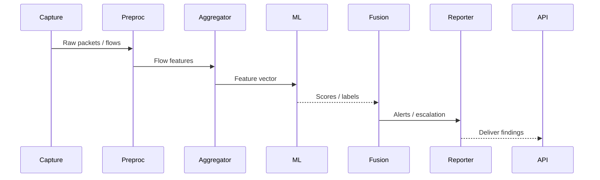

# Watchtower-ML — System Overview

## Summary
This document describes the current Watchtower-ML system: its runtime flow, code structure, key components, advantages compared to typical network-detection systems, what it currently excels at, and suggested improvements for future iterations.

---

## High-level Architecture

```mermaid
flowchart LR
  A[Packet Capture / Ingestion]
  B[Preprocessing Pipeline]
  C[Feature Store / Aggregation]
  D[ML Inference Service]
  E[Rule-based Detector / Hybrid Fusion]
  F[Escalation / Reporting]
  G[API / Orchestration]

  A --> B --> C --> D
  C --> E
  D --> E
  E --> F
  G --> D
  G --> E
  G --> F

  subgraph "Storage & Artifacts"
    S1[Preprocessing Pipeline (pickle)]
    S2[Saved Models / Checkpoints]
    S3[Data / CSV / Numpy]
  end

  C --> S1
  D --> S2
  C --> S3
```

### Sequence: Detection Request



---

## How the code works (current repo layout)

- Core entry points:
  - `src/main.py` — main orchestration (startup scripts, runner glue).
  - `src/run_detector.py` — runtime detector runner (ingests flows, invokes pipeline & inference).

- API & orchestration:
  - `src/api/app.py`, `src/api/routes/detection.py` — light HTTP endpoints to trigger detection and fetch results.

- Inference and detection:
  - `src/inference/predictor.py`, `src/inference/model_loader.py` — load models and run predictions.
  - `src/ingestion/csv_ingestion.py`, `src/ingestion/capture_reader.py` — ingestion helpers for CSVs and pcap.

- Preprocessing & models:
  - `src/preprocessing/preprocessing_pipeline1.py` — transformer pipeline used to convert raw flows to model-ready features.
  - `src/preprocessing/custom_transformers.py` — custom sklearn-style transformers.
  - `models/preprocessing_pipeline.pkl.backup` — serialized pipeline artifact (reference for reproducibility).

- Services & reporting:
  - `src/api/services/ml_inference_service.py`, `src/api/services/detection_service.py` — service layer decoupling business logic from routes.
  - `src/reporting/console_report.py` — console-based report sink.

Flow summary (runtime):
- Ingest raw capture (pcap or CSV) → apply `preprocessing` pipeline → aggregate flows → call `model_loader`/`predictor` to score → combine ML score with rule-based checks in `inference/fusion.py` or `escalation.py` → report/route results via API or console.

---

## Advantages vs other systems

- **Modular pipeline**: Clear separation between ingestion, preprocessing, inference, fusion, and reporting — easier to extend and test.
- **Hybrid detection**: Combines ML inference and rule-based fusion, reducing false positives where rules are stronger and using ML where patterns are subtle.
- **Reproducible preprocessing**: Uses serialized preprocessing pipeline artifact so features are consistent between training and inference.
- **Multiple ingestion formats**: Built to accept both CSV and pcap-derived flow data, making it flexible for offline and live evaluation.
- **Lightweight API layer**: Minimal orchestration allowing easy integration into larger systems or embedding into a stream processing framework.

---

## What it currently excels at

- Rapid experimentation: Notebook + script layout (see `notebooks/`) enables quick model iteration.
- Deterministic feature transforms via saved pipeline; simplifies model validation.
- Clear service separation: `api/services` isolates business logic from transport.

---

## Where this system can improve

- Production readiness
  - Add CI/CD tests, unit tests for critical transformers, and model-inference integration tests.
  - Add containerization (Dockerfile) and deployment manifests (k8s/compose).

- Observability
  - Add structured logging, metrics (Prometheus), and tracing to measure latency, throughput, and model drift.

- Model lifecycle
  - Add training / retraining pipelines, model versioning, and A/B testing / canary rollout support.
  - Implement dataset labeling and feedback loop to capture false positives/negatives for supervised retraining.

- Data quality & drift
  - Add schema validation (per `diagnostics/schema_checker.py`) into ingestion path, and continuous drift detection.

- Scalability
  - Move from batch CSV/pcap-driven flow to streaming ingestion (Kafka, Flink, or a lightweight asyncio loop) for higher throughput.

- Security & governance
  - Harden APIs, add authentication/authorization, and ensure sensitive data handling/privacy controls.

---

## Practical next steps (recommended roadmap)

1. Add a `README.md` at the project root summarizing quick start commands.
2. Add unit tests for `src/preprocessing/custom_transformers.py` and `src/inference/model_loader.py`.
3. Containerize the `run_detector` runtime and provide a simple `docker-compose.yml` to run the API + inference service.
4. Add an automated model evaluation job that loads `models/preprocessing_pipeline.pkl.backup` and a candidate model to validate performance before deployment.
5. Instrument key paths with metrics and create a basic Grafana dashboard for detection throughput and alert rates.

---

## File map (pointer to important files)

- [src/run_detector.py](src/run_detector.py)
- [src/main.py](src/main.py)
- [src/api/app.py](src/api/app.py)
- [src/api/routes/detection.py](src/api/routes/detection.py)
- [src/inference/predictor.py](src/inference/predictor.py)
- [src/inference/model_loader.py](src/inference/model_loader.py)
- [src/preprocessing/preprocessing_pipeline1.py](src/preprocessing/preprocessing_pipeline1.py)
- [src/preprocessing/custom_transformers.py](src/preprocessing/custom_transformers.py)
- [models/preprocessing_pipeline.pkl.backup](models/preprocessing_pipeline.pkl.backup)

---


